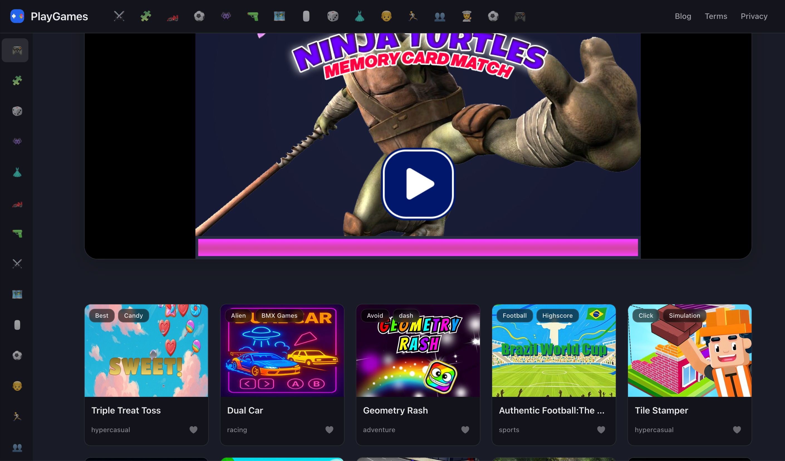

# 🎮 PlayGames.fan  

**PlayGames.fan** is an online platform for **HTML5 games**, offering a large collection of fun, instant-play games for both desktop and mobile devices.  

 <!-- Replace with actual screenshot -->

## 🌐 Live Demo  
👉 [https://playgames.fan](https://playgames.fan)  

---

## ✨ Features  
- **Huge collection of free HTML5 games** – no downloads, play instantly  
- **Cross-platform support** – works on desktop, tablet, and mobile browsers  
- **Fast loading** – lightweight design for quick game launch  
- **Well-organized categories** – Action, Puzzle, Racing, Shooting, and more  
- **Smart recommendations** – trending and popular games highlighted  

---

## 🛠 Tech Stack  
- **Frontend**: HTML5, CSS3, JavaScript  
- **Backend**: PHP (dynamic content & game data management)  
- **Database**: MySQL (game metadata & categories)  
- **CDN**: for game file distribution and fast delivery  
- **Deployment**: Nginx / Apache on Linux server  

---

## 📂 Project Structure  
```
playgames-fan/
│
├── index.php            # Website entry point
├── assets/              # Static resources (CSS, JS, images)
├── games/               # HTML5 game files
├── includes/            # Common components (header, footer)
├── config/              # Configuration files
└── README.md            # Project documentation
```

---

## 🚀 How to Run Locally  
1. Clone the repository  
   ```bash
   git clone https://github.com/your-username/playgames-fan.git
   cd playgames-fan
   ```
2. Set up a local PHP environment (PHP 8.0+)  
3. Start a local server  
   ```bash
   php -S localhost:8000
   ```
4. Open [http://localhost:8000](http://localhost:8000) in your browser  

---

## 🤝 Contributing  
Contributions are welcome! You can:  
- Add new game categories  
- Improve UI/UX  
- Enhance SEO  
- Optimize performance  

---

## 📈 SEO Keywords  
HTML5 games, online games, free browser games, PlayGames, puzzle games, action games, shooting games, racing games, mobile games  

---

## 📷 Screenshots  
> Add homepage, category, and game page screenshots here  

---

## 📜 License  
MIT License  
